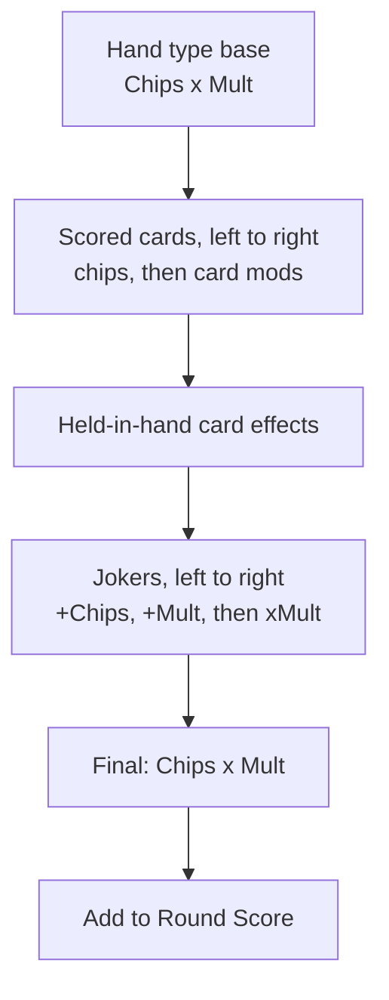

# Gambl Balatro — PRD (Gambl Series)

Sep 22, 2026 · Lex Stewart

## Overview

Gambl Balatro is a poker roguelike deck-builder for the Gambl series: players build poker hands, stack Joker cards into a scoring engine, and beat escalating score targets across 8 antes. It is modeled on Balatro's core loop, wrapped in a premium luxury casino presentation.

**Name.** The game ships in the hub as **Gambl Balatro**. Mechanics follow Balatro closely; all Joker names, Boss Blinds, card art and characters are original to this project.

**Goals**

- Faithful Balatro-style scoring loop: Chips x Mult = Score, with Joker combos that scale into the thousands and beyond
- Premium casino look and sound consistent with the rest of the Gambl series
- Four ways to play: Solo run, vs CPU (Easy / Medium / Hard), multiplayer via room codes, and a guided Tutorial
- A finished cover art tile so the game never shows a blank card in the game hub

**Platforms:** web first (desktop and mobile browsers), landscape layout primary, portrait supported on phones.

**Primary win condition:** clear the Boss Blind of Ante 8. Endless Mode unlocks after the first win.

## Core gameplay rules

Every hand scores Chips x Mult; players select up to 5 cards from an 8-card hand and either Play them or Discard them.

**Deck and hand**

- Standard 52-card deck, 4 suits, no Jokers in the deck (Jokers live in separate slots)
- Hand size: 8 cards. Max cards played or discarded per action: 5
- Per blind: 4 Hands and 3 Discards. Discarding redraws to 8
- Card chip values: 2–10 = face value, J/Q/K = 10, Ace = 11
- Only cards that form the poker hand score (a kicker in a Pair does not add chips)

**Poker hands (level 1 base values)**

| Hand | Base Chips | Base Mult | Chips per level | Mult per level |
| --- | --- | --- | --- | --- |
| High Card | 5 | 1 | +10 | +1 |
| Pair | 10 | 2 | +15 | +1 |
| Two Pair | 20 | 2 | +20 | +1 |
| Three of a Kind | 30 | 3 | +20 | +2 |
| Straight | 30 | 4 | +30 | +3 |
| Flush | 35 | 4 | +15 | +2 |
| Full House | 40 | 4 | +25 | +2 |
| Four of a Kind | 60 | 7 | +30 | +3 |
| Straight Flush | 100 | 8 | +40 | +4 |
| Five of a Kind (secret) | 120 | 12 | +35 | +3 |
| Flush House (secret) | 140 | 14 | +40 | +4 |
| Flush Five (secret) | 160 | 16 | +50 | +3 |

Secret hands only appear in the hand list once played; they require duplicated cards from shop effects.

**Hand leveling.** Planet cards (renamed *Chip Stacks* for the casino theme) raise one hand type by one level, shown as "lvl.2" next to the hand name.

**Scoring order (must be exact)**



Joker order matters: a xMult Joker placed after +Mult Jokers multiplies a bigger number, so players can drag Jokers to reorder them.

```
Score = (base chips + sum of card chips + sum of joker chips) x final mult
```

**Card modifiers** (applied through shop consumables): Bonus (+30 chips), Mult (+4 mult), Glass (x2 mult, 1 in 4 chance to shatter), Steel (x1.5 mult while held), Gold (+$3 if held at round end), Lucky (1 in 5 chance of +20 mult). Card editions: Foil (+50 chips), Holographic (+10 mult), Polychrome (x1.5 mult).

## Joker system

Jokers are passive cards in 5 slots that modify scoring; they are data-driven so new Jokers ship without touching the scoring engine.

**Joker types**

| Type | What it does | Example effect |
| --- | --- | --- |
| +Chips | Adds flat chips | +50 chips |
| +Mult | Adds to the multiplier | +4 mult |
| xMult | Multiplies the multiplier (strongest late game) | x2 mult |
| Retrigger | Makes scored cards trigger again | Retrigger each Ace |
| Economy | Earns money | +$4 at end of round |
| Conditional | Fires only on a hand type, suit or rank | +12 mult if hand is a Flush |
| Scaling | Grows each time a condition is met | +0.25 xMult per Straight played |

**Rarity and pricing**

| Rarity | Shop odds | Buy price | Sell price |
| --- | --- | --- | --- |
| Common | 70% | $4–6 | half of buy, rounded down |
| Uncommon | 25% | $6–8 | half of buy |
| Rare | 5% | $8–10 | half of buy |
| Legendary | never in shop | only from the *Jackpot* consumable | $10 |

Joker editions reuse card editions: Foil, Holographic, Polychrome, plus Negative (+1 Joker slot).

**Joker data schema**

```json
{
  "id": "high_roller",
  "name": "High Roller",
  "rarity": "uncommon",
  "type": "xmult",
  "trigger": "on_hand_scored",
  "condition": { "hand_type": "Full House" },
  "effect": { "xmult": 2.5 },
  "price": 7,
  "art": "jokers/high_roller.png",
  "description": "x2.5 Mult if played hand is a Full House"
}
```

Triggers: `on_hand_scored`, `on_card_scored`, `on_card_held`, `on_discard`, `on_round_end`, `on_blind_selected`, `passive`.

**Launch catalog: 30 original casino Jokers (starter set shown)**

| Joker | Rarity | Type | Effect |
| --- | --- | --- | --- |
| Lucky Chip | Common | +Mult | +4 mult |
| Pit Boss | Common | +Mult | +3 mult per Joker owned |
| Dealer's Tip | Common | Economy | +$4 at end of round |
| Red Velvet | Common | Conditional | Hearts and Diamonds give +3 mult when scored |
| Blackjack | Common | +Chips | +21 chips if scored cards total exactly 21 |
| Stack of Reds | Common | +Chips | +60 chips, loses 5 each hand played |
| Snake Eyes | Uncommon | Retrigger | Retrigger every scored 2 |
| Double Down | Uncommon | xMult | x2 mult on the last hand of the round |
| High Roller | Uncommon | xMult | x2.5 mult if hand is a Full House |
| Royal Flushed | Uncommon | Conditional | +15 mult if hand contains a Flush |
| Card Counter | Uncommon | Scaling | +1 mult per card left in deck |
| The House | Rare | xMult | x3 mult, -1 hand per round |
| Whale | Rare | Scaling | +0.1 xMult for every $5 you hold |
| Golden Ace | Rare | xMult | Each scored Ace gives x1.5 mult |
| The Croupier | Legendary | Retrigger | Retrigger all scored cards twice |
| Grand Jackpot | Legendary | xMult | x4 mult; gains x0.5 per Boss Blind beaten |

The remaining 14 Jokers are written to the same schema during the design pass; target mix is 18 Common, 7 Uncommon, 3 Rare, 2 Legendary.

## Progression and economy

A run is 8 antes of 3 blinds each (Small, Big, Boss); failing any blind's target ends the run.

**Blind rules**

- Small Blind target = 1x ante base; Big Blind = 1.5x; Boss Blind = 2x
- Small and Big Blinds can be skipped for a Tag (a free reward such as a free Rare Joker or double money next round)
- The Boss Blind is mandatory and carries a rule-breaking modifier
- Beating a Boss Blind advances to the next ante

**Score targets**

| Ante | Base | Small Blind | Big Blind | Boss Blind |
| --- | --- | --- | --- | --- |
| 1 | 300 | 300 | 450 | 600 |
| 2 | 800 | 800 | 1,200 | 1,600 |
| 3 | 2,000 | 2,000 | 3,000 | 4,000 |
| 4 | 5,000 | 5,000 | 7,500 | 10,000 |
| 5 | 11,000 | 11,000 | 16,500 | 22,000 |
| 6 | 20,000 | 20,000 | 30,000 | 40,000 |
| 7 | 35,000 | 35,000 | 52,500 | 70,000 |
| 8 | 50,000 | 50,000 | 75,000 | 100,000 |

Endless Mode (after Ante 8) scales the base by roughly x1.6 per ante.

**Original casino Boss Blinds (launch set)**

| Boss | Modifier | Earliest ante |
| --- | --- | --- |
| The Cold Deck | All Spades are debuffed | 1 |
| The Marked Card | All Hearts are debuffed | 1 |
| The Loaded Dice | All Clubs are debuffed | 1 |
| The Shill | All Diamonds are debuffed | 1 |
| The Pit Lock | Only 1 discard this round | 2 |
| The Table Limit | Max 3 cards per hand | 2 |
| The Eye in the Sky | First hand drawn face down | 2 |
| The House Edge | Played hand type levels down by 1 | 3 |
| The Velvet Rope | Must play only one hand type all round | 4 |
| The Heavy Hitter | Target is 4x base instead of 2x | 5 |
| The Final Call (Ante 8 only) | 1 hand, all Jokers except the leftmost disabled | 8 |

**Money**

- Start each run with $4
- Blind reward: Small $3, Big $4, Boss $5 (shown as $$$ on the blind panel)
- +$1 per unused Hand at round end
- Interest: +$1 per $5 held, capped at +$5 per round

**Shop (after every blind cleared)**

- 2 random slots: Jokers, Chip Stacks (hand level-ups) or Tarot-style *Dealer Cards* (card modifiers)
- 2 Booster Packs: Joker Pack, Chip Stack Pack, Dealer Pack, Playing Card Pack (open, pick 1 of 3)
- 1 Voucher: a permanent run upgrade (+1 hand, +1 discard, +1 Joker slot, cheaper rerolls)
- Reroll costs $5, rising $1 per reroll, resetting each shop
- Consumable slots: 2

## Game modes

The main menu offers four modes: Solo Run, vs CPU, Multiplayer and Tutorial.

### Solo Run

The standard 8-ante run described above, with Endless Mode after a win.

### vs CPU

Player and CPU run the same seed (same shop, same draws) side by side; from Ante 2 onward, every Boss Blind is replaced by a **Showdown**: whoever scores higher in that blind wins it.

- Each side has 3 lives (shown as poker chips); losing a Showdown costs 1 life and pays $4 consolation
- Last side with lives, or the first to clear Ante 8, wins
- The CPU's round score and life count are always visible; its Jokers are hidden

| Difficulty | CPU behavior |
| --- | --- |
| Easy | Plays the best hand in its current 8 cards, rarely discards, buys random affordable Jokers, never reorders Jokers |
| Medium | Discards toward Flushes and Straights, buys Jokers that match its most-played hand, orders +Mult before xMult, keeps $5+ for interest |
| Hard | Evaluates expected score across possible discards, builds a focused engine, rerolls for xMult Jokers, uses skips and Tags strategically, maximizes interest |

CPU think time is 0.6–1.2 s per action so it feels like a player at the table.

### Multiplayer (room codes)

The official Balatro is single-player only. The community multiplayer mod runs 1v1 matches joined by room code, with a planned Battle Royale for up to 8 players ([PCGamesN](https://www.pcgamesn.com/balatro/multiplayer-mod)). Gambl Balatro ships both: a 1v1 mode and a table mode, with a **max of 8 players per table**.

| Mode | Players | Rules |
| --- | --- | --- |
| Heads-Up (default) | 2 | Same seed; every Boss Blind from Ante 2 is a Showdown; 3 lives each |
| High Stakes Table | 3–8 | Same seed; each Boss Blind, the lowest score loses a life; 2 lives each; last player standing wins |

**Room flow**

1. Host taps Create Room, picks mode and table size (2–8)
2. Server generates a 6-character code (letters and digits, no 0/O/1/I), shown large with a Copy and Share button
3. Friends tap Join Room and enter the code; the lobby shows each seat as a poker chip with the player's name
4. Host taps Deal to start once 2+ players are seated; empty seats close
5. Codes expire after 30 minutes idle or when the match ends

Disconnects: a player has 60 s to rejoin with the same code; after that their seat folds (counts as eliminated). Spectating is off in v1.

### Tutorial

A guided, fixed-seed run of 1 ante where each step unlocks only after the player completes it. A dealer character speaks in short captions and a gold spotlight highlights the relevant UI.

1. Select 5 cards and play a Pair — explains Chips x Mult on the score panel
2. Discard to chase a Flush — explains Hands vs Discards counters
3. Beat the Small Blind — explains targets and the $$$ reward
4. Shop: buy Lucky Chip — explains Jokers and money
5. Reorder two Jokers — shows how xMult last boosts the score
6. Use a Chip Stack to level up Pair
7. Skip the Big Blind for a Tag — explains skipping
8. Face a Boss Blind (The Cold Deck) — explains boss modifiers

Tutorial can be replayed from Settings; it is offered automatically on first launch and can be skipped.

## Screen layout

The in-game screen copies the reference layout: a vertical info panel on the left, Joker row across the top, played cards in the center, and the hand fanned along the bottom, all on a felt table.

**In-game wireframe (landscape)**

```text
+-------------------+--------------------------------------------------------+
| [ SMALL BLIND ]   |  JOKERS (2/5)                         CONSUMABLES (0/2)|
|  (blind chip)     |  [J1] [J2] [ ] [ ] [ ]                        [ ] [ ]  |
|  Score at least   |                                                        |
|    800            |                    +10  (floating chip pop)            |
|  Reward: $$$      |                                                        |
|-------------------|            [10D] [10C] [7H] [7S]   <- played cards     |
| Round score   0   |                                                        |
|-------------------|                                                        |
| Two Pair  lvl.1   |                                                        |
| [ 40 ] x [ 2 ]    |   [c][c][c][c][c][c][c][c]   <- 8-card hand            |
|  blue    red      |   [ PLAY HAND ]  [ SORT: Rank|Suit ]  [ DISCARD ]      |
|-------------------|                                              DECK 44/52|
| Hands 3 Discards 4|                                                        |
| $  12             |                                                        |
| Ante 2/8 Round 5  |                                                        |
| [Run Info][Options]                                                        |
+-------------------+--------------------------------------------------------+
```

**Left panel, top to bottom** (fixed width, about 22% of screen)

| Block | Content | Style |
| --- | --- | --- |
| Blind header | Blind name (Small / Big / Boss name) | Navy bar, gold text |
| Blind card | Blind chip icon, "Score at least" + target, Reward $$$ | Boss blinds use a red chip with the boss icon |
| Round score | Running total with chip icon | Counts up digit by digit |
| Hand preview | Hand type + level, then Chips box x Mult box | Chips box royal blue, Mult box casino red, gold "x" |
| Counters | Hands (blue number), Discards (red number) | Two side-by-side tiles |
| Money | Current $ | Gold, bounces on change |
| Progress | Ante n/8, Round n | Small white text |
| Buttons | Run Info, Options | Red and navy pill buttons |

**Center and top**

- Joker row across the top with slot counter (2/5); Jokers wiggle and flash a label (+4 Mult, x2) as they trigger
- Consumable slots top right (0/2)
- Played cards rise to center and pop their chip value above them, one at a time, left to right
- Hand of 8 along the bottom; tapping a card lifts it; Play and Discard buttons below; hand preview in the left panel updates live as cards are selected
- Deck counter bottom right

**Portrait (phones):** left panel collapses into a top bar (blind + target, round score, Chips x Mult, hands/discards/money); Jokers sit under it; hand stays at the bottom.

**Other screens:** Main menu (mode buttons as stacked chips), Blind select (three blind cards side by side with Select / Skip and the Tag shown under skippable blinds), Shop (items on felt with gold price tags, Reroll and Next Round buttons), Cash Out screen (itemized: blind reward, unused hands, interest), Game Over / Victory, Multiplayer lobby (room code large at top, seats below).

## Visual style

The look is a high-limit VIP room: deep green felt, gold trim, navy and black framing, with casino chips scattered around the table edges.

**Palette**

| Token | Hex | Use |
| --- | --- | --- |
| Felt Green | #0F5132 | Table surface (subtle marbled texture) |
| Felt Shadow | #0A3A24 | Vignette at table edges |
| Royal Gold | #D4AF37 | Trim, titles, money, highlights |
| Champagne Gold | #F1D78A | Gold gradients and glints |
| Navy | #0B1F4B | Left panel, headers |
| Dark Blue | #1A3A8F | Chips box, Hands counter |
| Casino Red | #C8102E | Mult box, Discards counter, Boss Blinds |
| Onyx Black | #0B0B0D | Frames, background behind table |
| Ivory | #FAF7F0 | Card faces, body text |

**Chip scatter.** 8–12 poker chips (red $5, blue $10, green $25, black $100, gold $500) rest at fixed spots around the felt border, partly overlapping the frame and slightly rotated. They never overlap cards or UI. On big scores, a few chips bounce and settle.

**Premium details**

- Gold beveled borders on every panel, with a slow light sweep every 8 s
- Card backs: navy with a gold filigree pattern and a crown emblem
- Typography: a display serif for titles (Playfair Display or Cinzel), a bold rounded sans for numbers (Montserrat ExtraBold)
- Soft spotlight from above the table; cards cast short shadows

**Visual effects**

| Event | Effect |
| --- | --- |
| Card scores | Card jumps, chip value pops above it in blue |
| Joker triggers | Joker wiggles, red "+Mult" or gold "xMult" label pops |
| Chips x Mult resolve | Two boxes slam together, number bursts into Round Score |
| Score over 1 million in one hand | Screen shake, gold chips rain from top, number tints gold |
| Blind beaten | Gold confetti and chip fountain from the blind icon |
| Boss Blind appears | Lights dim, red spotlight on the boss chip, modifier text slides in |
| Cash Out | Coins fly from each line item into the money counter |
| Glass card shatters | Shards scatter off-screen |
| Game over | Cards slide off the table, felt fades to black |
| Showdown won / lost (vs CPU, multiplayer) | Gold "WIN" stamp / red chip cracks and falls from life counter |

## Sound design

Every game action maps to a real casino sound, so a scoring combo sounds like a table heating up.

| Event | Sound | Notes |
| --- | --- | --- |
| Select card | Soft card slide on felt | Pitch varies slightly per card |
| Deal / draw | Crisp card flick from a shoe | Rapid series when refilling to 8 |
| Discard | Cards swept into the muck | Short swish |
| Shuffle (new blind) | Riffle shuffle + bridge | 1 s |
| Card scores chips | Single clay chip clack | Pitch rises with each card in the hand |
| +Mult Joker triggers | Two chips clinking | |
| xMult Joker triggers | Chip stack slammed on felt + low brass hit | Heavier as the multiplier grows |
| Retrigger | Quick double chip riffle | |
| Final score resolve | Slot-machine reel stop + ding | |
| Huge hand (1M+) | Jackpot bells, coins pouring, crowd "ooh" | Plays over music |
| Blind beaten | Winning bell + short applause | |
| Cash Out | Cash register "cha-ching" per line item, coins cascading into the money total | Signature sound of the series |
| Buy in shop | Chips pushed across felt + register tick | |
| Sell Joker | Chip rack slide | |
| Reroll | Roulette wheel spin + ball drop | |
| Open Booster Pack | Envelope tear + card fan | |
| Boss Blind appears | Low piano sting + room hush | |
| Showdown won | Dealer bell "ding ding" | vs CPU and multiplayer |
| Life lost | Chip dropping and rolling away | |
| Game over | Slow slot machine wind-down | |
| Player joins room | Chair pull + chip rack set down | Multiplayer lobby |
| Tutorial step complete | Soft chime | |

### Soundtrack

All music is smooth, upscale casino lounge jazz, built from layered stems so it can intensify during play without hard cuts.

| Track | Where it plays | Feel | Length |
| --- | --- | --- | --- |
| High Limit Lounge | Main menu and mode select | Slow piano, upright bass, brushed drums, soft vibraphone | 2:30 loop |
| Felt & Fortune | Small and Big Blinds | Mid-tempo swing with walking bass and muted trumpet | 3:00 loop |
| The Pit Boss | Boss Blinds | Same groove plus a horn section and a darker minor key | 2:45 loop |
| Last Call | Final hand when the target isn't met yet | Tempo +15%, tense rhythm stab, ticking hi-hat | Layer over current track |
| Velvet Rope | Shop | Bossa nova with nylon guitar and light shaker | 2:00 loop |
| Showdown | vs CPU and multiplayer Showdowns | Big-band hit, driving drums | 2:15 loop |
| Jackpot Fanfare | Run won | Brass fanfare into a celebratory swing tag | 0:12 sting |
| House Wins | Game over | Slow descending piano and a muted trombone "wah-wah" | 0:08 sting |
| Private Table | Multiplayer lobby | Chill lounge groove, finger snaps | 1:30 loop |
| Dealer School | Tutorial | Stripped-down piano trio, quiet so captions read clearly | 2:00 loop |

**Behavior**

- Crossfade 1.5 s between tracks; the Boss Blind layer fades in over 2 s when the boss is revealed
- Music ducks by 40% during the Cash Out and Jackpot sound effects
- Default volume: Music 60%, SFX 80%, Ambience 20%
- Files: OGG (with MP3 fallback), 44.1 kHz, loops cut seamlessly
- Source: original compositions or royalty-free commercial-use licensed tracks only

**Mix:** separate Music, SFX and Ambience sliders; ambience is a quiet casino-floor bed (distant slots, murmured crowd) at 20% by default.

## Cover art

The game hub tile must show finished cover art and the title, never a blank card; the art ships with v1 and is a release blocker.

**Concept.** A fanned hand of three cards on green felt under a spotlight: an Ace of Hearts on the left, a gold-trimmed Royal Flush fan behind, and an original Joker card in front. The Joker is a new character: a sharp-dressed casino dealer in a navy vest and gold bow tie, grinning, with a jester-style hat in red and gold. Poker chips (red, blue, black, gold) are scattered in the foreground, one chip stack mid-topple.

**Title treatment.** "GAMBL BALATRO" in gold beveled display serif across the top, with a small "GAMBL SERIES" tag in ivory above it. Dark navy-to-black gradient frame with a thin gold border.

**Deliverables**

| Asset | Size | Use |
| --- | --- | --- |
| Hub tile | 1024 x 1024 PNG | Game hub card (square) |
| Hub banner | 1920 x 1080 PNG | Featured / hover state |
| App icon | 512 x 512 PNG | Joker card on felt, no text |
| Loading screen | 1920 x 1080 PNG | Cover art with a gold progress bar |

**Rules:** readable at 200 px wide; title contrast at least 4.5:1; no copied Balatro card art or characters; a subtle gold shimmer animation on hover in the hub.

## Tech stack and acceptance criteria

Build on the same web stack as the rest of the Gambl series: React + TypeScript front end, PixiJS for the table and card animation, Node.js + WebSocket (Socket.IO) server for rooms, Howler.js for audio.

**Architecture rules**

- The scoring engine is a pure TypeScript module with no UI imports, unit-tested against hand-computed examples
- Seeded RNG (one seed per run) drives deck, shop and boss selection, so vs CPU and multiplayer players see identical draws
- Jokers, Boss Blinds, Tags, Vouchers and consumables load from JSON files
- Server is authoritative in multiplayer: clients send actions, the server validates and broadcasts scores
- Room state kept in memory with Redis for room codes; no accounts required in v1

**Out of scope for v1:** accounts and friends lists, ranked matchmaking, spectators, voice chat, in-app purchases, stakes/difficulty tiers beyond the base game.

**Acceptance criteria**

- [ ] All 12 poker hands detected correctly, including Ace-low straights (A-2-3-4-5)
- [ ] Scoring matches the documented order; Joker reorder changes the result as expected
- [ ] 8-ante run is completable; failing any target ends the run
- [ ] Shop, rerolls, interest and cash-out math match the Progression section
- [ ] vs CPU: Easy, Medium and Hard are playable; Hard beats Easy in at least 80% of 100 simulated runs
- [ ] Multiplayer: 1v1 Heads-Up and High Stakes Table (up to 8 seats) work; friends join by code; 60 s reconnect works
- [ ] Tutorial completes all 8 steps and can be replayed from Settings
- [ ] In-game layout matches the wireframe in landscape and collapses correctly in portrait
- [ ] Casino palette, chip scatter and every VFX and SFX event in the tables are implemented
- [ ] Soundtrack plays per screen with crossfades and the Boss / Last Call layers
- [ ] Cover art tile, banner, icon and loading screen are in the game hub
- [ ] 60 fps on a mid-range phone during a 1M+ scoring animation

**Sources**

- [Balatro Multiplayer mod coverage, PCGamesN](https://www.pcgamesn.com/balatro/multiplayer-mod)
- [Balatro Multiplayer mod, GitHub](https://github.com/Balatro-Multiplayer/BalatroMultiplayer)
